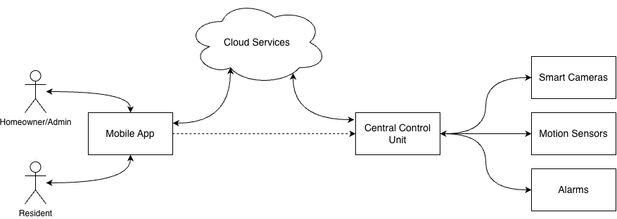

# Overview

## System Context

The Smart Home Security System (SHSS) operates within a residential environment and provides monitoring, event detection, and user alerting through a combination of local and cloud-connected services.

SHSS includes a Central Control Unit (CCU), smart cameras, motion sensors, alarm devices, cloud services, and a mobile application used by homeowners and residents. Smart cameras and motion sensors communicate with the CCU over the local residential network. The CCU performs local coordination, event processing, device management, and alarm control.

Cloud services provide remote connectivity, notification delivery, synchronization, and support for remote monitoring and control through the mobile application. The system is designed to maintain core local security functionality during temporary loss of internet connectivity.

Figure 2.1 illustrates the system context and major interfaces between users, cloud services, and local system components.

_Figure 2.1: System Context Diagram_

## System Functions

### Monitoring

SHSS continuously monitors the residential premises using connected sensing and surveillance devices. Monitoring includes collection of motion events, video data, device status, connectivity information, and other security-related system information.

### Event Detection

SHSS processes data from connected devices to detect security-related events, such as motion, intrusion, and abnormal system conditions. Detected events are evaluated to determine appropriate alerting and alarm actions.

### Alerting and Notifications

SHSS provides local audible alarms and remote user notifications through the mobile application, delivering real-time alerts for detected events and system conditions. The system supports configurable alert preferences and alert severity levels.

### Video Surveillance

SHSS provides authorized users with access to live video feeds and recorded footage through the mobile application. Recorded event data is available for review and playback.

### Remote Monitoring and Control

SHSS allows authorized users to receive alerts and notifications, view live and recorded video feeds, and manage system settings remotely through the mobile application.

### Device and System Management

SHSS manages connected devices through configuration, status monitoring, diagnostics, and maintenance support functions. The system performs self-diagnostics and provides feedback regarding system health, connectivity, and operational status.

## User Characteristics

### Residents

Residents are the primary occupants of the home and may have access to the SHSS mobile application for receiving alerts and notifications, viewing live and recorded video feeds, and performing limited remote system control functions. Residents may also configure personal preference settings.

### Homeowners / Admin

Homeowners or designated administrators have full access to SHSS management and monitoring capabilities through the mobile application. They are responsible for system configuration, user management, device management, alert configuration, and overall system administration.

### Installers / Technicians

Installers and technicians are responsible for the installation, setup, diagnostics, and maintenance of SHSS devices. They may use specialized tools and interfaces for device provisioning, configuration, and troubleshooting during installation and maintenance activities. Access provided to installers and technicians is limited to installation and maintenance functions and does not extend to regular system operation or user management activities.